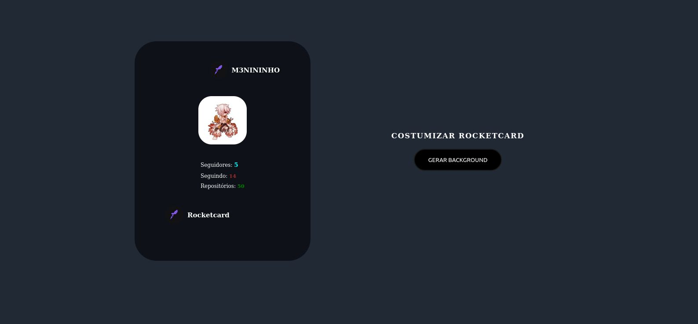
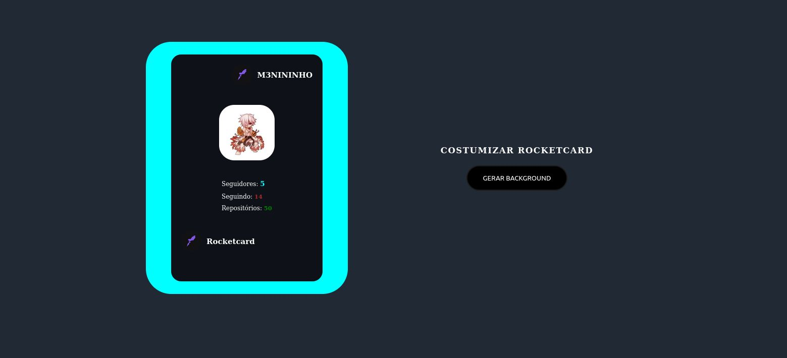

<h1 align="center"> Meu perfil no Github </h1>

 

## 🚀 Tecnologias

Esse projeto foi desenvolvido com as seguintes tecnologias:

- HTML e CSS
- JavaScript

 
<h3 align="center">Tela de recriação </h3>

 
  

 

<h3 align="center">Tela de recriação - 2 </h3>

 
  

 

## 💻 Projeto

O projeto é um desafio da **Rocketseat** e tem como objetivo a utilização da API do **Github**.  
O desafio também solicita que crie um botão que altere o background do card.No projeto foi adicionado mais de 10 cores diferentes.
